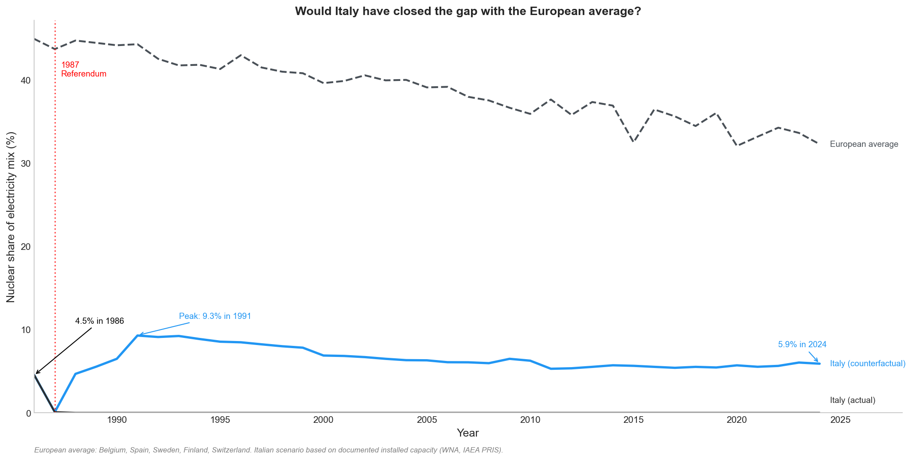
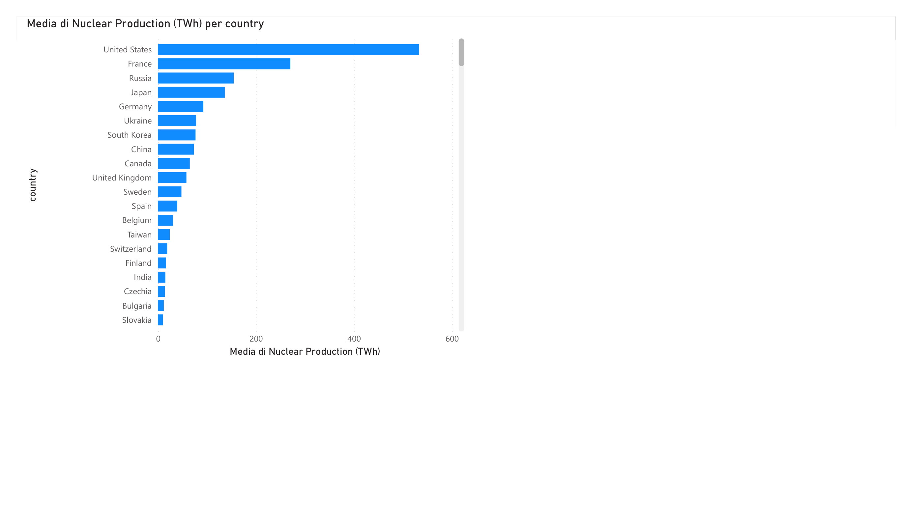
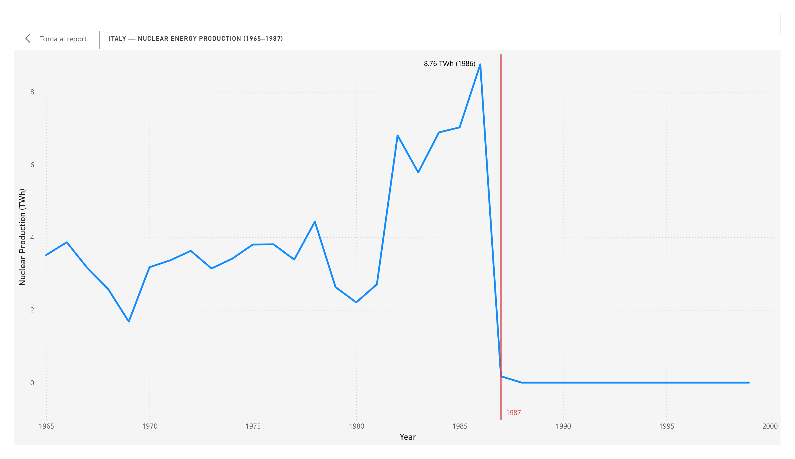

# Italy 1987 Nuclear Referendum — Historical and Counterfactual Analysis


Historical and counterfactual analysis of nuclear energy production,
with a focus on Italy's post-1987 referendum trajectory.
Data pipeline built on open datasets (Our World in Data / Energy Institute / World Nuclear Association).

**Core question:** what would Italy's energy mix look like today
if the Montalto di Castro plant — 80% complete in 1988 — had been commissioned?

---

## Methodology — Counterfactual Analysis

The realistic scenario is built on documented historical data:

- **Montalto di Castro** (2 x 982 MWe BWR): 80% complete in February 1988, halted by the referendum.
  Source: Sources: World Nuclear Association — Nuclear Power in Italy (https://world-nuclear.org/information-library/country-profiles/countries-g-n/italy); ENEA — Il nucleare in Italia: storia e prospettive (2011); IAEA PRIS — historical load factor data (https://pris.iaea.org)
- **Load factor**: 75% (conservative European average for the period)
- **Trino Vercellese** (260 MWe): assumed end of operational life ~2000
- **Post-Fukushima** (2011+): 15% reduction applied for extraordinary maintenance

The scenario places Italy in the **lower range of European nuclear producers** — consistent with Finland, which had a similar installed capacity at the time. It is a conservative estimate, not an optimistic one.

CO2 displacement assumes gas substitution at 490 gCO2/kWh vs nuclear at 12 gCO2/kWh
(source: IPCC lifecycle emissions estimates).

---

## Key Findings

- Only **36 countries** have ever produced nuclear energy
- The **USA** leads with 533 TWh average historical production — more than double France
- Italy abandoned nuclear power after the **1987 referendum**, when its share was just 4.5% of the electricity mix
- After 1987, **gas consumption in Italy grew by +109 TWh** — nearly 5x — replacing nuclear and driving all demand growth
- A realistic counterfactual analysis (based on documented plant capacity) suggests Italy could have produced **~20 TWh/year** by 1991, placing it in the lower range of European nuclear producers
- Completing only Montalto di Castro (80% built in 1988, never opened) would have saved an estimated **642 TWh of gas** and avoided **307 Mt of CO2** between 1988 and 2024
- Even completing only Montalto di Castro, Italy would have reached a **maximum of 9.3%** nuclear share in 1991 — well below the European average of ~40%.
  By 2024 it would have declined to ~6%, confirming nuclear was always a marginal support source in the Italian energy mix, not a dominant one

---

## Visualizations

### Top 10 nuclear producers (historical average)

*The United States leads global nuclear output by far, yet France — producing half as much — covers over 70% of its electricity needs with nuclear, making it far more nuclear-dependent. Average production per country, years with output > 0.*  
*Source: Our World in Data / Energy Institute — Statistical Review of World Energy 2024.*
### Italy — nuclear history (1965–2025)

*Italy produced nuclear electricity from 1965 to 1987, peaking at 8.76 TWh in 1986. 
Following the referendum, production dropped to zero within one year and has remained 
there ever since.*  
*Source: Our World in Data / Energy Institute — Statistical Review of World Energy 2024.*
### Italy — energy mix: what replaced nuclear?

*Source: Our World in Data / Energy Institute — Statistical Review of World Energy 2024.
Electricity generation by source, Italy, 1965–2023.*
### Top 5 countries — historical trend

*Chernobyl (1986) had no measurable impact on the top 5 producers. Fukushima (2011) 
devastated Japan — production collapsed from ~280 TWh to ~152 TWh in a single year, 
eventually falling further as all reactors were progressively shut down. The US and 
France saw minor reductions. Russia and China continued expanding output uninterrupted, 
reflecting fundamentally different regulatory responses.*  
*Source: Our World in Data / Energy Institute — Statistical Review of World Energy 2024.*
### France vs Germany — two opposite choices

*France maintained ~70% nuclear share for 40 years; Germany, starting from a similar base, 
closed its last reactor in 2023. Same technology, opposite political choices.*  
*Source: Our World in Data / Energy Institute — Statistical Review of World Energy 2024.*
### Italy — counterfactual scenario (All plants operational)

*Counterfactual trajectory assuming no referendum: Caorso and Trino continue operating, 
Montalto di Castro (2 × 982 MWe, 80% complete in 1988) enters service by 1991, peak ~20 TWh. 
Post-Fukushima -15% reduction applied from 2011. Conservative estimate — lower bound only.*  
*Sources: World Nuclear Association — Nuclear Power in Italy; IAEA PRIS; IPCC AR6.*
### Italy — European validation (real unscaled trajectories)

*Italy's counterfactual output compared against the European average (Belgium, Spain, Sweden, 
Finland, Switzerland). Italy would have remained well below the European average even 
completing all plants under construction.*  
*Source: Our World in Data / Energy Institute — Statistical Review of World Energy 2024.*
### Italy — nuclear share % vs European countries

*Italy's hypothetical nuclear share would have peaked at 9.3% in 1991 — less than a quarter 
of the European average (~40%) at the time, declining to ~6% by 2024.*  
*Source: Our World in Data / Energy Institute — Statistical Review of World Energy 2024.*
---

## Power BI Dashboard

Interactive dashboard built in Power BI Desktop, connected to the SQLite database via ODBC.

### Top 10 nuclear producers


### Italy nuclear history


---
## Conclusions

- Only **36 countries out of 224** have ever produced nuclear electricity
- The **USA leads** in absolute output (533 TWh average), but **France** covers ~70% of 
  its electricity needs with nuclear — a fundamentally different strategic posture
- Italy peaked at **8.76 TWh and 4.5% nuclear share in 1986**; after the referendum, 
  gas grew by +109 TWh (5×), replacing nuclear entirely
- A conservative counterfactual suggests Italy could have reached **~20 TWh by 1991** 
  (9.3% share), avoiding **642 TWh of gas** and **307 Mt of CO₂** between 1988 and 2024
- Even so, Italy would have remained in the **lower range of European producers** — 
  well below the ~40% European average. Closing that gap would have required a far 
  larger programme. The referendum cancelled a support source, not a strategic pillar

  ---
  
## Stack
- **Python** — pandas, numpy, matplotlib, seaborn
- **SQLite** — local database with 2 tables, ~12k rows
- **SQL** — aggregation, filtering, joins, window functions (LAG, RANK)
- **Jupyter Notebook** — EDA and visualizations
- **Git / GitHub** — version control and portfolio publishing
- **Power BI** — interactive dashboard connected to SQLite via ODBC

## Project Structure
```
nuclear-data-analysis/
├── data/
│   ├── raw/          ← original CSV files (Our World in Data)
│   └── processed/    ← cleaned data
├── db/
│   └── nuclear.db    ← SQLite database
├── notebooks/
│   ├── 01_data_exploration.ipynb    ← EDA
│   └── 02_visualizations.ipynb     ← charts and counterfactual analysis
├── sql/
│   ├── 01_lag_rank_window_functions.sql
│   ├── 02_cte_global_average.sql
│   └── 03_base_exploration_queries.sql
├── etl/
│   └── load_data.py  ← ETL pipeline
├── plots/            ← exported charts (Python + Power BI)
└── nuclear_dashboard.pbix  ← Power BI dashboard (connected to SQLite via ODBC)
```

## Data Sources
- [Our World in Data — Energy](https://ourworldindata.org/energy) (Energy Institute / Ember)
- Energy Institute Statistical Review of World Energy 2025
- World Nuclear Association — Nuclear Power in Italy (https://world-nuclear.org/information-library/country-profiles/countries-g-n/italy)
- ENEA — Il nucleare in Italia: storia e prospettive (2011)
- IAEA PRIS — Power Reactor Information System (https://pris.iaea.org)

## Author
Giuseppe Vigliotti — [LinkedIn](https://linkedin.com/in/giuseppe-vigliotti)
MSc Nuclear Engineering, Politecnico di Milano
