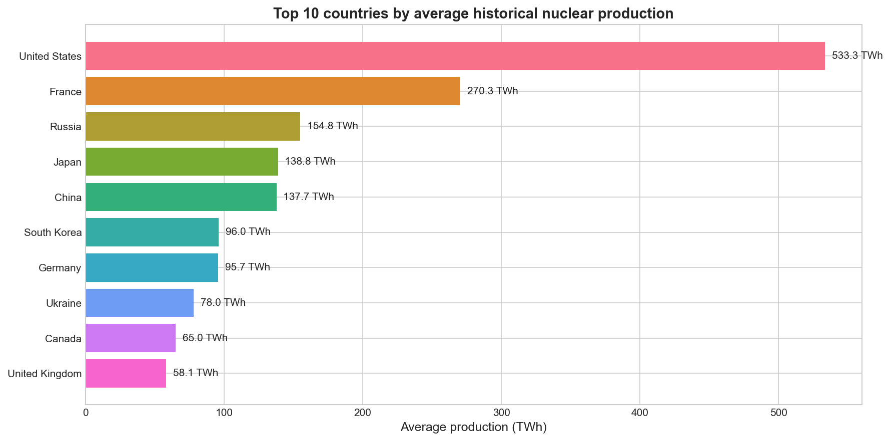
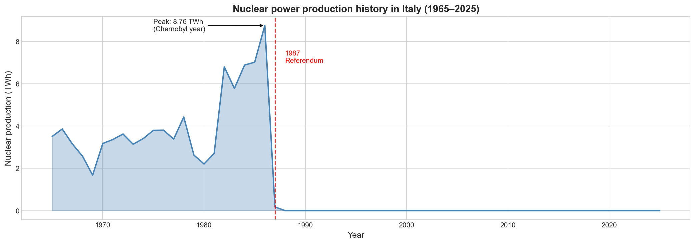
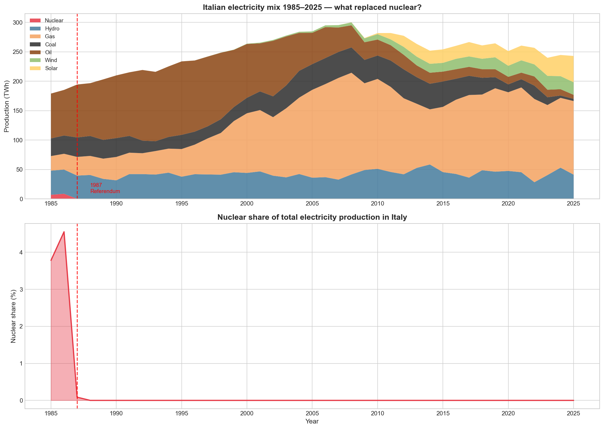
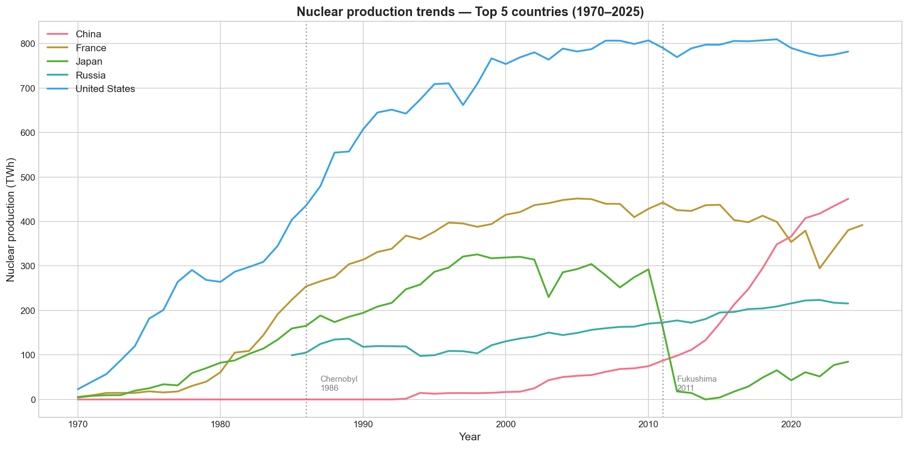
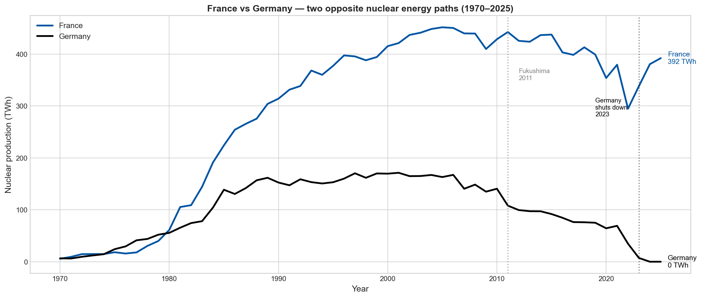
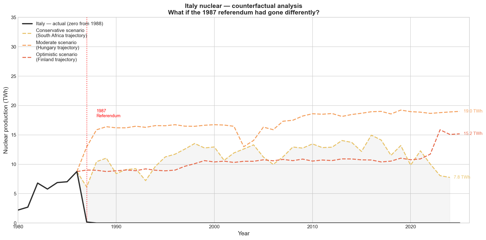
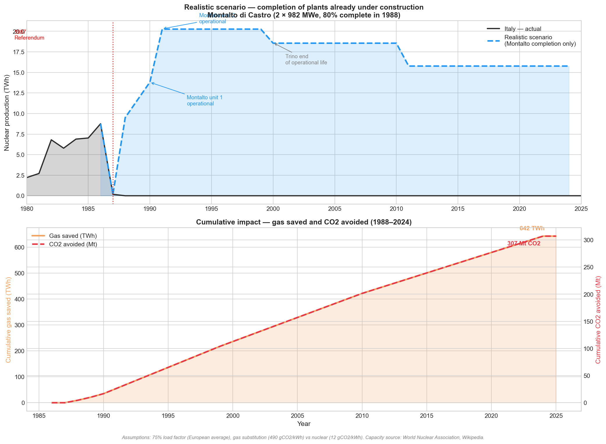
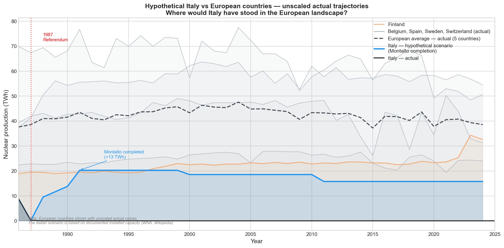

# Nuclear Data Analysis

Exploratory data analysis on open nuclear energy datasets (Our World in Data / Energy Institute).  
Built as a portfolio project to demonstrate Python, SQL, ETL pipeline, and data visualization skills.

---

## Key Findings

- Only **36 countries** have ever produced nuclear energy
- The **USA** leads with 533 TWh average historical production — more than double France
- Italy abandoned nuclear power after the **1987 referendum**, when its share was just 4.5% of the electricity mix
- After 1987, **gas consumption in Italy grew by +109 TWh** — nearly 5x — replacing nuclear and driving all demand growth
- A realistic counterfactual analysis (based on documented plant capacity) suggests Italy could have produced **~20 TWh/year** by 1991, placing it in the lower range of European nuclear producers
- Completing only Montalto di Castro (80% built in 1988, never opened) would have saved an estimated **642 TWh of gas** and avoided **307 Mt of CO2** between 1988 and 2024
- Even completing only Montalto di Castro, Italy would have reached a **maximum of 9.3%** nuclear share in 1991 — well below the European average of ~40%. 
  By 2024 it would have declined to ~6%, confirming nuclear was always a marginal support source in the Italian energy mix, not a dominant one

---

## Visualizations

### Top 10 nuclear producers (historical average)


### Italy — nuclear history (1965–2025)


### Italy — energy mix: what replaced nuclear?


### Top 5 countries — historical trend


### France vs Germany — two opposite choices


### Italy — counterfactual analysis (three benchmark scenarios)


### Italy — realistic scenario (Montalto di Castro)


### Italy — European validation (real unscaled trajectories)


### Italy — nuclear share % vs European countries


---

## Methodology — Counterfactual Analysis

The realistic scenario is built on documented historical data:

- **Montalto di Castro** (2 x 982 MWe BWR): 80% complete in February 1988, halted by the referendum.  
  Source: Wikipedia, World Nuclear Association
- **Load factor**: 75% (conservative European average for the period)
- **Trino Vercellese** (260 MWe): assumed end of operational life ~2000
- **Post-Fukushima** (2011+): 15% reduction applied for extraordinary maintenance

The scenario places Italy in the **lower range of European nuclear producers** — consistent with Finland, which had a similar installed capacity at the time. It is a conservative estimate, not an optimistic one.

CO2 displacement assumes gas substitution at 490 gCO2/kWh vs nuclear at 12 gCO2/kWh  
(source: IPCC lifecycle emissions estimates).

---

## Stack
- **Python** — pandas, numpy, matplotlib, seaborn
- **SQLite** — local database with 2 tables, ~12k rows
- **SQL** — aggregation, filtering, joins, window functions (LAG, RANK)
- **Jupyter Notebook** — EDA and visualizations
- **Git / GitHub** — version control and portfolio publishing

## Project Structure
```
nuclear-data-analysis/
├── data/
│   ├── raw/          ← original CSV files (Our World in Data)
│   └── processed/    ← cleaned data
├── db/
│   └── nuclear.db    ← SQLite database
├── notebooks/
│   ├── 01_data_exploration.ipynb    ← EDA
│   └── 02_visualizations.ipynb     ← charts and counterfactual analysis
├── sql/              ← saved SQL queries (window functions, base exploration)
├── etl/
│   └── load_data.py  ← ETL pipeline
└── plots/            ← exported charts
```

## Data Sources
- [Our World in Data — Energy](https://ourworldindata.org/energy) (Energy Institute / Ember)
- Energy Institute Statistical Review of World Energy 2025
- World Nuclear Association — Italy country profile
- Wikipedia — Montalto di Castro Nuclear Power Station

## Author
Giuseppe Vigliotti — [LinkedIn](https://linkedin.com/in/giuseppe-vigliotti)  
MSc Nuclear Engineering, Politecnico di Milano
