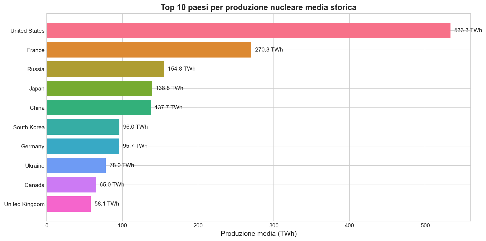
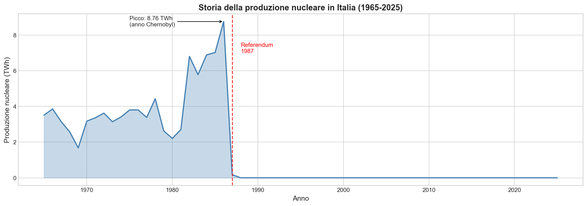
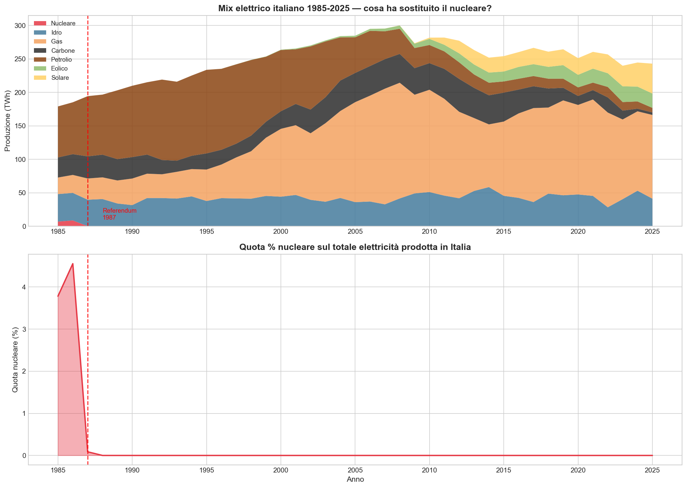
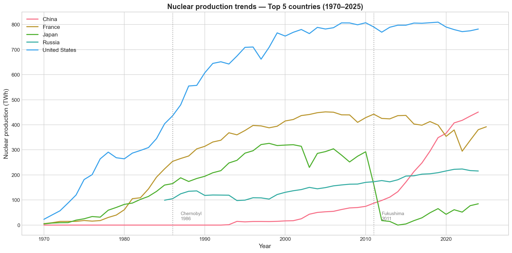
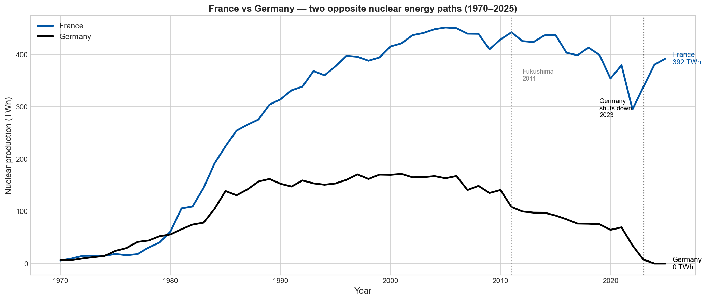
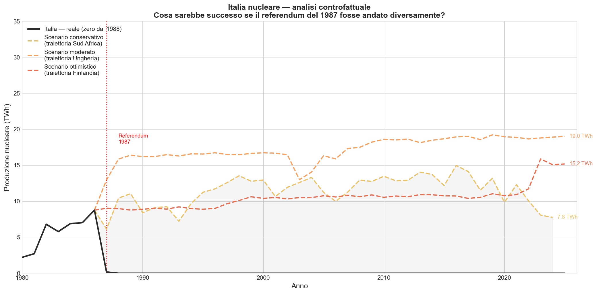

# Nuclear Data Analysis

Exploratory data analysis on open nuclear energy datasets (Our World in Data / Energy Institute).  
Built as a portfolio project to demonstrate Python, SQL, and data visualization skills.

---

## Key Findings

- Only **36 out of 224 countries** have ever produced nuclear energy
- The **USA** leads with 533 TWh average historical production — more than double France
- Italy abandoned nuclear power after the **1987 referendum**, when its share was just 4.5% of the electricity mix
- After 1987, **gas consumption in Italy grew by +109 TWh** — nearly 5x — replacing nuclear and driving all demand growth
- A counterfactual analysis suggests Italy could have reached **15–19 TWh** of nuclear production by 2023 under moderate/optimistic scenarios

---

## Visualizations

### Top 10 nuclear producers (historical average)


### Italy — nuclear history (1965–2025)


### Italy — energy mix: what replaced nuclear?


### Top 5 countries — historical trend


### France vs Germany — two opposite choices


### Italy — counterfactual analysis


---

## Stack
- **Python** — pandas, numpy, matplotlib, seaborn
- **SQLite** — local database with 2 tables, ~12k rows
- **SQL** — queries for aggregation, filtering, joins
- **Jupyter Notebook** — EDA and visualizations

## Project Structure
```
nuclear-data-analysis/
├── data/
│   ├── raw/          ← original CSV files (Our World in Data)
│   └── processed/    ← cleaned data
├── db/
│   └── nuclear.db    ← SQLite database
├── notebooks/
│   ├── 01_esplorazione_dati.ipynb   ← EDA
│   └── 02_visualizzazioni.ipynb     ← charts and analysis
├── sql/              ← saved SQL queries
├── etl/
│   └── load_data.py  ← ETL pipeline
└── plots/            ← exported charts
```

## Data Sources
- [Our World in Data — Energy](https://ourworldindata.org/energy) (Energy Institute / Ember)
- Original data: Energy Institute Statistical Review of World Energy 2025

## Author
Giuseppe Vigliotti — [LinkedIn](https://linkedin.com/in/giuseppe-vigliotti)  
MSc Nuclear Engineering, Politecnico di Milano